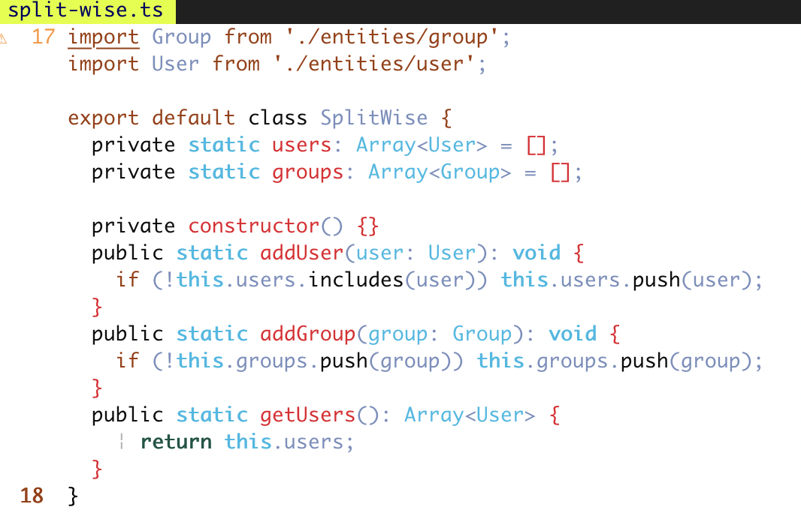

# Simba 

simba colors for vim. 

## Install

Use [vim-plug](https://github.com/kartik1998/simba.vim) or any other plugin manager of your choice:

```viml
Plug 'kartik1998/simba.vim'

colorscheme simba
```

### Simba


### Simba Black


### Simba Light


License - [WTFPL](https://www.google.com/search?q=whatever+the+fuck+you+want+license&oq=whatever+the+fuck+you+want+license&aqs=chrome..69i57.4758j0j1&sourceid=chrome&ie=UTF-8)

